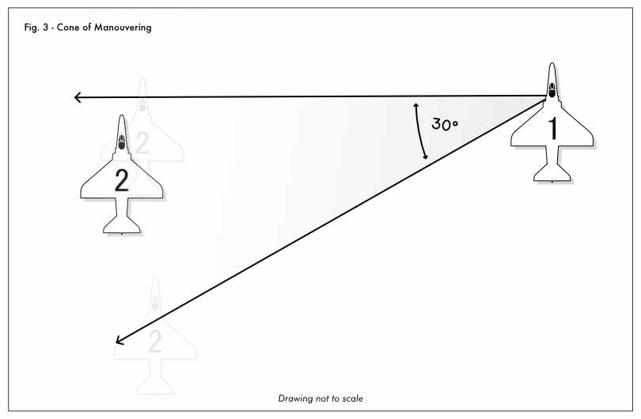
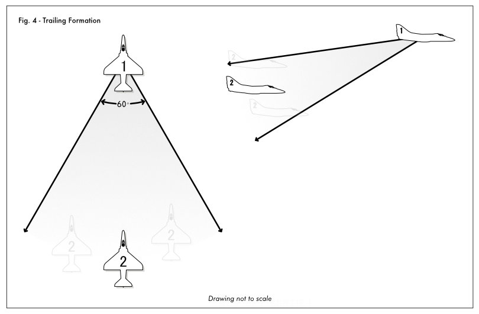

# Sortie 1 - Flight Briefing

## Flight Outline
The basic outline of this flight is as follows:
1. Delayed Take-off
2. Rejoin into formation
3. Formation flight transit to exercise range
4. Practical ground attack exercise
5. reform and transit flight back to airfield
6. Delayed landing

This document will cover the aspects of the formation flying you are expected to perform in this flight, the specific Ground attack exercise will be covered in the [Ground Attack Exercise][Sortie 1 - Ground Attack Exercise] section.

## Taxi, Takeoff, Transit

### Pre-Taxi checklist
Before we begin taxiing it is important that you have all of the important information you will need for your flight. Such as required radio frequencies, TACAN numbers, specific waypoints, and any mission specific information. You also need to ensure you know your taxi route to the runway in use. 

Once you have the required information, you will then take one last check of your aircraft to make sure it is ready for the mission. Does it have the required equipment, enough fuel, waypoints input, correct livery?

Once everything is set up correctly we will want to begin and complete a pre-taxi checklist. These are specific to whichever airframe you are flying, here is one from the A-4E-C to look at as an example.

Once the flight lead has completed their checklist they will announce it via the radio, and they will await a response from each aircraft in the flight to ensure everyone is ready to go. If you are needing a moment or have a problem speak up and let them know.

### Taxiing
Once the flight lead has determined that the flight is ready to taxi, and has made the appropriate radio calls, they will make a call along the lines of:

> Talon 1-1: TALON FLIGHT, TAXI

Watch the next aircraft in the flight ahead of you, and start rolling once they are clear of their taxi position and starting to move.

Once taxiing, ensure enough spacing between yourself and the aircraft ahead of you. If you are struggling to keep up then let them know via your radio. Ensure to keep taxi speeds to safe and manageable levels, slow down appropriately before turns, and follow the plan you created for taxiing to your destination. 

### Pre-takeoff Checklist
Before entering the runway your flight will stop at the hold-short line and perform the final pre-takeoff checklists. As before with previous checklists the flight lead will call out when they are complete and await a response from each aircraft before continuing.

### Takeoff Positioning and Delayed Roll
Once the flight has completed all checklists, and cleared to enter the runway, they will line up along the runway heading in a staggered formation. 

Once in position jets will call out their position in the flight and ready, an example of that is:
> Talon-1-1: ONE Set
> Talon 1-2: TWO Set
> Talon 1-3: THREE Set
> Talon 1-4: FOUR set

Once all jets are set the flight lead will call to "spin it up" which means setting the aircraft to the maximum power setting that brakes can hold, this is airframe specific. The flight lead then gives the command __"Brakes Brakes Brakes"__, and in a formation take-off the last brakes signifies when you should release your brakes, in a delayed take-off this is when you start your timer. Once the timer countdown completes the next jet will also call out "Brakes Brakes Brakes" which starts the timer for the next aircraft in the formation.

### Rejoining in formation
Once airborne the flight lead will begin a climbing orbit around the airfield as briefed. This is to allow the aircraft in the formation the ability to rejoin into formation. To help this process your IP may be calling out heading and speed information in intervals.

To safely rejoin a formation the two elements are closure and reference. You want to keep your closure speed to no more then 25 knots IAS once you are within 1 nm. You also need to keep visual reference on the other aircraft ahead of you in formation at all times. If you can't see them, you can't avoid them.

If you at any point lose visual reference of the aircraft ahead of you in formation, immediately call it out:
> Talon 1-2: TALON TWO, BLIND ONE

As you rejoin the formation you need to control your speed and positioning. You are aiming to end up right next to the lead aircraft with little to no difference in IAS. You will need to use Lag and Lead pursuit to increase and decrease the amount of distance you are flying to position yourself correctly.

If you need to slow down, then push to lag behind the lead aircraft, if you are falling behind and need to catch up, then pull lead. Be careful when pulling lead to ensure you do not lose sight of the other aircraft or place them below the belly of your aircraft, *this is incredibly dangerous*.

If you are approaching too quickly, remember you need to aim behind the lead aircraft so that you slow down, this way if you overshoot the lead aircraft you create a safe separation, and maintain visual reference on the lead aircraft.

### Positioning within the Formation
You are looking to position yourself relative to the lead aircraft in a similar position that you found yourself on the runway, not too far ahead, and not too far behind (sucked). There is approximately a 30° arc next to the lead aircraft you want to find yourself in, and you want to be about one aircrafts width away.

You will find yourself moving in this cone a lot at first, but through practice you will find it easier to maintain a fixed position. This is to be expected. As a wingman in close formation you have only one job, and that is to keep visual reference on the jet ahead of you, and maintain that positioning. There are other formations that allow you to look at sensors or work on things in your aircraft, those will be covered in later training.

You will fly in this formation until just before entering your exercise range.

### Transition to Trailing Formation
Shortly before entering your training range, the flight lead will call for the flight to transition into a trailing formation. This is a formation where you will be behind the flight lead about four or five aircraft lengths away, and slightly below. This should give you a good view of the lead aircraft and make it easier for you to maneuver.

Transitioning into this position in the formation can be done by adjusting your power setting to slow down and then pulling behind the lead. There are other ways to perform this change of positioning that will be covered in later sorties, however you are free to use them if you know how.

### Fuel State
During this sortie you may be asked to check in, or "say state". This is a request from the flight lead to determine your current fuel status in the aircraft. Your fuel state is read out in thousands and decimal hundreds, a fuel state of 1400lbs is read out as ONE POINT FOUR.

A radio transmission of this can look like:
> Talon 1-1: TALON FLIGHT, say STATE  
> Talon 1-2: TWO, ONE POINT FOUR

### Rejoin after Range Exercise
After checking out of the range, your flight lead will have you perform specific turns to specific headings to get the flight back into a cohesive formation. The flight lead will ask for a check in and give fuel states. When you give a fuel state you read it off in thousands and decimal hundreds, in the following example you have 2400 lbs of fuel left:

> Talon 1-1: TALON FLIGHT, say state  
> Talon 1-2: TALON TWO, TWO POINT FOUR

### Traffic and Delayed Landing
Once your flight is cleared to land the flight lead will landing circuit upwind stage over the runway, then turning crosswind. You are expected to remain in formation during this process. Once on the downwind leg of the flight, your IP will break off early, calling their turn to Base. You will wait 10 seconds, and then begin your turn, calling out your turns to base and final. Aim to land centerline on the runway.

### Hot and Cold Runway
A runway can be divided between a hot and cold side. This allows multiple aircraft to land in short succession safely. You will always aim to touch down on the centerline before moving over to the hot side of the runway, then transition over to the cold side once below 60 knots. If we are using a drag chute to slow down, we will wait to drop it until we are on the cold side of the runway.

The cold side of the runway is generally defined as the side with the taxiway that you will be using to leave the runway. This should be briefed before landing.

### Taxi and shutdown
Once safe to do so the Flight lead will lead the flight to taxi off the runway and to the parking area. Once in the parking area you are free to shutdown your aircraft, or disconnect. The flight lead will then get ready to debrief the flight.

Congratulations, if you got to this point and your jet is intact, then you have successfully finished flying the first Sortie. Take a breath, and shake out the cramps from flying so much formation. This is not easy at first, but it does improve over time!

