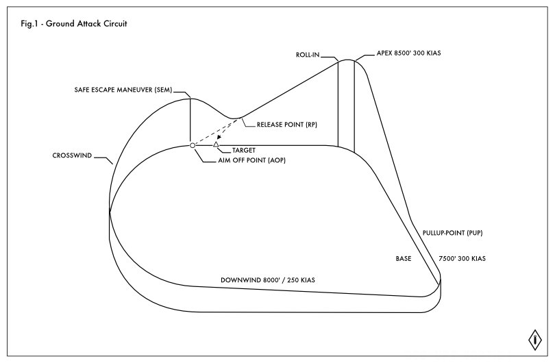

## Overview
The ground attack exercise in this sortie is a modified ground attack circuit flown in a close trailing formation. This exercise is similar to an attack run where the second aircraft closely follows the first to watch for threats, but the focus of this exercise is to help you become familiar with the basic circuit and to exercise flying in formation and keeping visual reference on a lead aircraft.

The first flights through the circuit are with you in trailing formation to allow you to observe the route and learn the visual landmarks. Then you will be put in lead position to allow the IP to observe. After the exercise is completed you will fly out of the range under the directions of your IP.

### The Circuit
A Ground attack circuit shares a lot of similarities with a landing circuit. Our Exercise is a modified version of the normal ground attack circuit, so that it better suits our needs.

The important aspects for our flight are:
1. Crosswind Turn
2. Downwind
3. Base Turn
4. Roll-in (IN)
5. Release Point (RP)
6. Safe Escape Maneuver (SEM)

### The Crosswind Turn, and Downwind Leg
Your IP will start the pattern by flying over the target range and pointing out the target too you. You will then follow the IP into the crosswind turn and into the downwind leg. You need to pick out the visual queues you can use to tell where you need to end your crosswind turn, and where to line up your downwind flight path. Look for a fixed point in the distance, or ground feature that you can use as your guide.

### Base Turn
At your base turn you will want to start a gentle climb. You are not flying directly at the target, you are flying to maintain the target above your canopy rail. We will be flying with a fixed power setting, so your speed will come down on by itself.

### Roll IN
After passing the Apex point and starting your turn in on target you will roll over and in towards the target. Pay attention to where the target is in relation to your canopy rail. You might miss it the first time around and that is expected. When you have the target in the correct sight picture for this exercise then you roll over and fly down towards it. You want to aim the point that your aircraft flies toward, the center point of roll, which is closely related to the bore sight position, *not* the target pipper, at a point just past the target. This way when your pipper passes over the target, you will be at the release point.

### Release Point and Safe Escape Maneuver
On your first passes of the circuit while following your IP, you will not release weapons at the release point, instead focus on keeping visual reference on your flight lead, and follow them through the Safe Escape Maneuver (SEM). When you are in the lead position with the IP following you, then you will release your weapons as the pipper passes over the target, which indicates you are at the release point. After weapon  separation begin your SEM by rolling the opposite direction of your roll in, and start climbing towards the point where you will begin your crosswind turn.

In a normal ground attack circuit the SEM ensures that you are out of the range of any shrapnel or explosions from your ordinance as quickly as possible. The quick change of trajectory and the use of counter-measures helps avoid any attacks from the ground. These steps are not necessary in this exercise but not forbidden as long as it does not negatively impact your ability to carry out the exercise.

After finishing your SEM, you will turn back and begin the crosswind turn, repeating the entire circuit again.

### The switch
After several runs through the circuit your IP will switch positions in the formation with you, and  you will lead the flight around the circuit. You do not need to do anything to facilitate this change. On the downwind leg of the flight your IP will change course by approximately 45°, do not follow them, continue the circuit. Your IP will perform a maneuver that increases the distance their jet must travel, allowing them to position themselves behind you in formation without changing their speed. This is a similar method that you can use to transition from an echelon to trailing formation, however it is not required, and be aware of the airspace around you before using positioning maneuvers like this.

### Finishing the Exercise
After your IP is satisfied with the exercise, or the minimum fuel state is reached, you will be instructed to continue flying the pattern but skipping the roll-in and SEM portions. You should fly straight and level around the circuit. You will be instructed to turn to a specific heading, read back the instructions, and on the flight leads mark, perform a level turn at full non reheat power in a 30° bank.

The command via radio and the typical response could be:
> Talon 1-1: TALON FLIGHT, turn RIGHT, TWO SEVEN FIVE  
> Talon 1-2: TWO, RIGHT, TWO SEVEN FIVE  
> Talon 1-1: MARK

Once out on this heading you will have left the exercise range, and you will begin rejoining into formation for the transit flight to the airfield.

