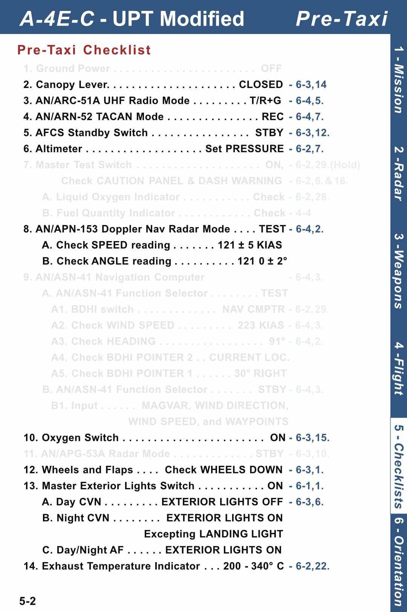
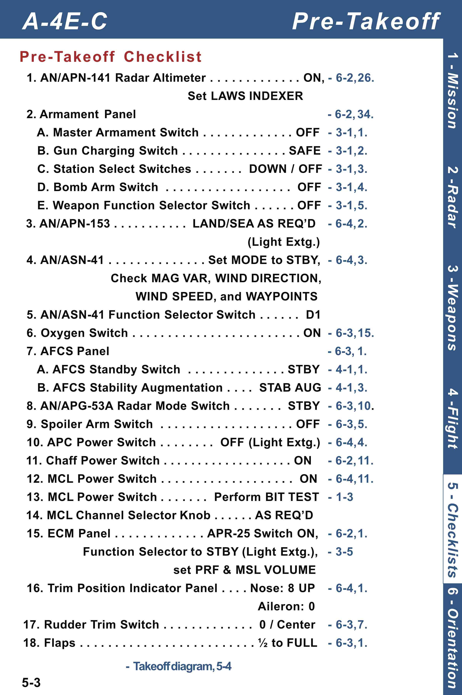
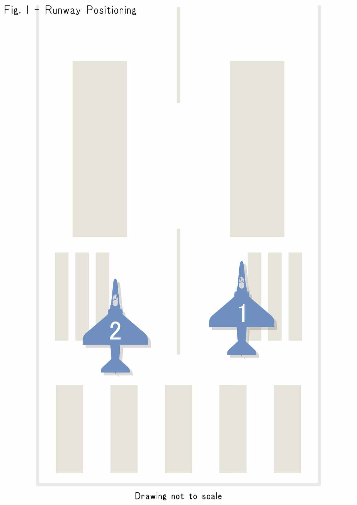
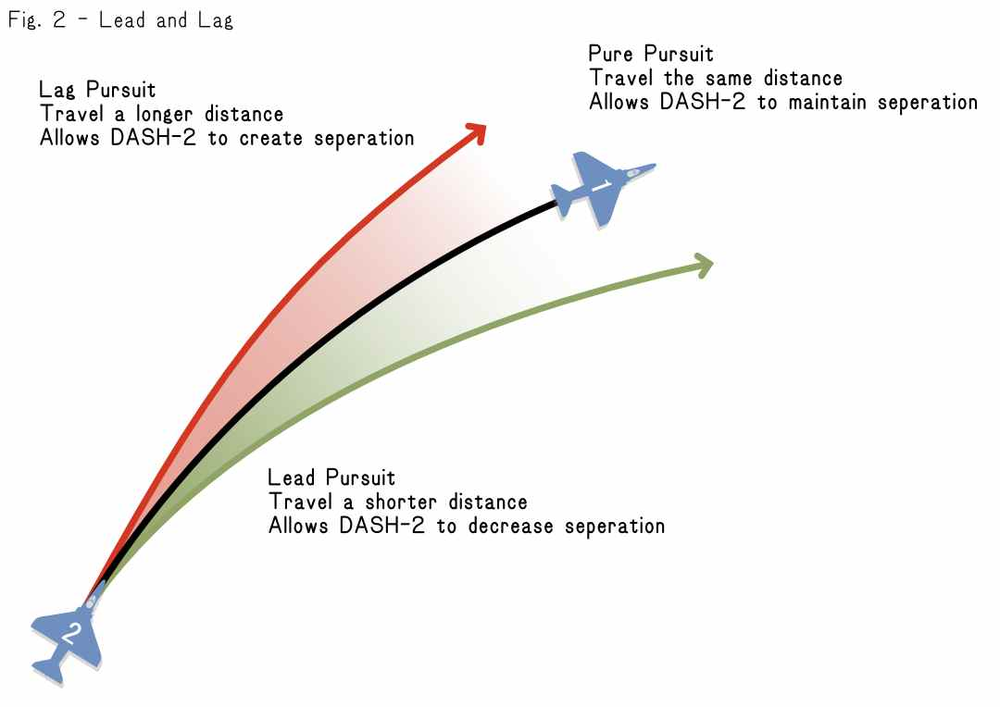
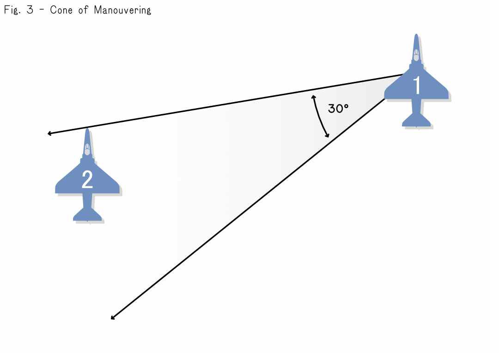
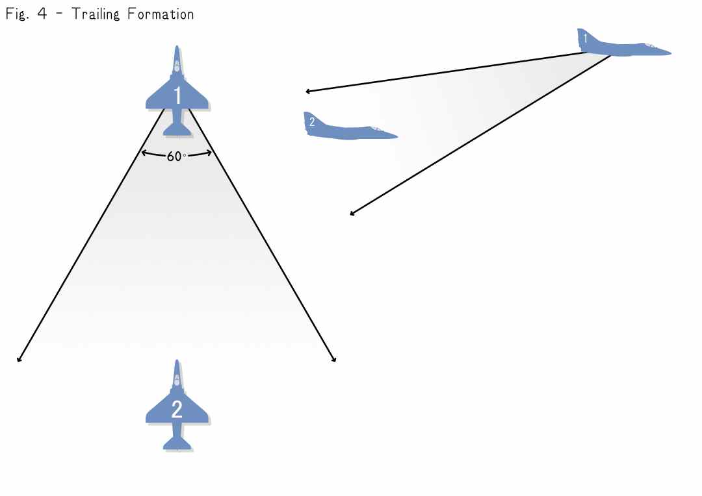

# DCS Undergraduate Pilot Training Program
# Sortie 1 Training Package
## About this Sortie
This is our first sortie of the DCS UPT Program, It will be used to assess where the Cadet pilot is in their skills, as well as begin introducing the standards of operations (SOPs) in the 3or4 VFW.

It is your responsibility, as a Cadet, to ensure you have reviewed this information and understand it before scheduling a sortie with your IP. If you have questions, or are unclear about anything, please reach out to an IP to get clarification or help. Grading criteria is available below for viewing. Flying with your fellow Cadets is a great way to prepare for UPT sorties, and we highly encourage it.

More information on our Training Program can be found [here](../training_program).

## Table of Contents
The Basic flight plan for sortie 1 is as follows:
- Basic communications
    - [Structure of Communications](#structure-of-communications)
    - [Radio Etiquette](#radio-etiquette)
    - [Unified Non-Towered Airfield Communication](#unified-non-towered-airfields)
    - [Inter-flight Communication](#inter-flight-communication)
- [Taxi and Take-off](#taxi-and-take-off)
    - [Taxiing](#taxiing)
    - [Take-off](#takeoff)
- [Rejoin and transit](#rejoin-and-transit)
    - [Safe-Rejoins](#safe-rejoins)
    - [Positioning and Formation](#positioning-and-formation)
- [Bombing Range Pattern](#bombing-range-pattern)
    - [The Pattern](#the-pattern)
- [Return to base and landing]

## Basic Communications
Communication is a fundemental part of flying as an organized group. The following outlines the structure of proper radio communication, use of plain language, Non-towered airfield communications, and inter-flight communications.

### Structure of Communications

The basis of most radio communications is the "ABC" structure. It is designed to make it quick and easy to understand. A. who is being addressed and by B. whom. Followed by C. which is the subject of the call. A helpful way to remember this is "A this is B, where is C?". Remembering that "B is me" will ensure there is no confusion as to who you are speaking to. 

> **A** this is **B**, where is **C**?

So now that we understand the basic structure, how does it sound in use? Here is an example:

> NELLIS TRAFFIC, TALON 1, Training flight of TWO A4s, Taxiing from APRON via BRAVO to RUNWAY TWO THREE RIGHT

**A.** Firstly, this call is to all traffic within the Nellis airspace. We will go into greater detail (here[#non-towered-airfields]) on non-towered airfield communication.

**B.** Secondly, the sender identifies the callsign of the flight, in this case TALON 1, this allows other pilots to know who is transmitting. Then, the sender identifies some key details about the nature of their flight as this is their first call on the frequency. Typically the number and type of aircraft the flight contains, and in this case, that it is a training flight.

**C.** Finally, the sender indicates that their flight intends to position for departure on runway 23R.

Lets take a look at another example:

> TALON 1, FLIGHT, check in 253

In this example, a flight has just executed a frequency change, and the lead pilot has made a call on that new frequency to confirm their wingmen have made the switch succesfully. Wingmen would reply with their number in the flight, such as "2", to acknowledge.

Let's take a look at one last example.

> TALON 1-1, Fox One, Mig-29

This call is different. It does not say who it is too specifically, it simply states the sender's callsign, and what they are doing. Talon 1-1 identifies themselves, then calls "Fox 1" as a brevity word to indicate they have launched a semi-active radar guided missile and the target is a Mig 29

This is an example of a brevity word used to convey an action, state, or request, in a quick and concise manner. A list of common brevity words can be found [here](../appendix/brevity), but for now, step by step instructions will be provided for most tasks a Cadet will be expected to perform.

#### A Note on Plain Language

While brevity words can be very efficient, sometimes an issue can not be fully conveyed without being more verbose or descriptive. Or the correct brevity word may not be known to the pilot. In these, and similiar cases, plain english certainly can be used, and is preferable to delayed comms, or no comms at all.

### Radio Etiquette

Just like using structure, brevity, and plain language to help us communicate clearly, we need to observe good radio etiquette so that everyone is able to communicate in a timely manner.

The basics of Radio Etiquette are, Think, Press, Speak

- Push to talk, not push to think
- Press transmit before you start talking
- Speak clearly and be concise. Say only what is necessary to convey your message.

Communications are the key to flying effectively as a group, but the reality of radio communication is that only one operator may transmit at a time. Another transmission at the same time renders both unintelligible, and a long transmission may leave others waiting to convey urgent messages. If you begin transmitting, but are unsure what to say, STOP. Think it through and begin again when the air is clear. Following the above guidelines will help to minimize your radio footprint, and ensure you are speaking in a standard format that others will easily understand. 

#### Break! Break!
An important brevity call you might hear on the radio is **Break! Break!**.

This signifies that an important transmission needs to come through, you are to pay attention and await the incoming transmission. Only once this transmission has come through should you then make radio transmissions.

### Non-Towered Airfields

DCS Does not have an indepth Air Traffic Control system, so to facilitate a safe and organized airspace we have adopted a Unified Non-Towered Airfield protocol (UNAP). Their are two key differences between the UNAP and a Towered Airfield protcols, the first is that in UNAP airspace pilots announce their intentions over the radio instead of making requests of an ATC Controller. The second key difference is noted in the difference of suffix, in UNAP airspace transmissions are made to TRAFFIC instead of TOWER.

Becuase UNAP airspace does not have a traffic controller, it is essential for all pilots to coordinate their movement both on the ground, and in the the air, to prevent unsafe conditions. Aircraft taxiing on the airfield must announce their intentions for movement, including their start location, destination, and approximate taxi-ways.

An example of a towered airfield radio transmission:
> NELLIS TOWER, TALON ONE, REQUESTING taxi to runway TWO THREE RIGHT

An example of an UNAP radio transmission:
> NELLIS TRAFFIC, TALON ONE, Taxiing to runway TWO THREE RIGHT

Pilots intending to land at an UNAP controlled airfield should announce their bearing, distance and type when entering the airspace at about 10-20 nautical miles from the airfield. On entering the traffic pattern of the airfield, pilots should announce the direction they are joining the traffic from, and which stage of the traffic pattern they are in. Pilots should continue to announce the stages of their pattern as they pass through them.

An example of an UNAP radio transmission announcing entry into the air space 10 miles around the airfield with the intention to land:
> NELLIS TRAFFIC, TALON ONE FLIGHT, TWO ship, 10 miles on approach for runway FIVE ZERO.

An example of an UNAP radio transmission announcing joining the pattern:
> NELLIS TRAFFIC, TALON ONE FLIGHT, joining upwind, Three-thousand AGL, runway FIVE ZERO.

Aircraft departing the UNAP airfield should announce their intended departure direction as such:
> NELLIS TRAFFIC, TALON ONE FLIGHT, departing NORTH

A common convention you may hear some pilots use is to repeat the recipient of the traffic call at the end, by wrapping your radio transmission with the location on both ends we ensure that it is clear which airfield the transmission is for when more then one airfield share a common frequency. This also provides pilots who may have truned in during your transmission to know critical information that they have missed at the beginning of the transmission. This is not a requirement, especially on shorter calls.

Further information for real world procedures see this [FAA document (AC_90-66B Non-Towered Airport Flight
Operations)](https://www.faa.gov/documentLibrary/media/Advisory_Circular/AC_90-66B.pdf)

### Inter-flight Communication

Normally air assets, such as your training flight, are given a tactical callsign often followed by a number to identify them. In this case TALON is the tactical callsign, and ONE lets us know that this is flight number one. This number is important when there is more then one TALON flight operating in a given area.

Inter-flight communication is the name given to all communications between the aircraft that comprimise a flight. The flight adopts modified callsigns, removing the tactical callsign and using instead their position within the flight. The flight leader as DASH ONE, and wingmen will then be numbered DASH TWO, DASH THREE, and DASH FOUR respectively.

Most inter-flight communications will take place on a dedicated channel specifically used by the flight. By using an unique radio frequency a flight is able to protect the integrety of their transmissions. Inter-flight communication uses a simplified form of the ABC radio conventions, this is to assure that the radio frequency is held clear for time critical callouts between members of the flight. 

Common inter-flight communication is split in two rolls. Firstly the flight lead will make requests, and the wignmen will respond with their number, for example DASH-TWO will simply transmit the shortened reply "TWO".

An example of the shortened inter-flight transmissions between a flight lead and their wingman would sound like:
> Talon 1-1: TALON FLIGHT, left turn to THREE-HUNDRED

> Talon 1-2: TWO

> Talon 1-3: THREE

> Talon 1-4: FOUR

Wingmen are expected to communicate over the radio when significant events happen, these are not limited to but include: 
- SAM launch smoke trail, or ground fire tracers detected.
- Obsticles posing an immediate danger to the flight. 
- Malfunctions, or unexpected difficulties with the aircraft or manouver.
- Changes in aircraft state such as BINGO callouts or fuel state.

Most importantly when flying in formation wingmen should call out when they lose visual sight of the flight lead or aircraft they are following in formation (more on this is covered in [Sortie 2](../sortie-2/training))

Inter-flight communications may also happen on a non-interflight frequency, such as during landing operations. In these situations the flight lead will call for their flight to check in once on the new radio channel to ensure all members of the flight are tuned to the correct frequency. The same format will be used by the flight for checking in.

An example a two ship flight check in on 127.5 MHz:
> TALON FLIGHT, check in ONE TWO SEVEN POINT FIVE

> TWO

#### Helmet Fire

When pilots have too much radio traffic, the sounds of the aircraft, missile tones, RWR gear, and perhaps even intercom radio chatter from their back seat, we call this *helmet fire*.

This is a condition where a radio operator is overwhelmed. In this situation the operator will need to start prioritizing information and will not be able to appropriately recieve or react to incoming traffic. It can quickly become a dangerous situation as the pilots ability to fly and assess threats is quickly overwhelmed.

It can be difficult to know if the pilot you are transmitting with over a shared frequency is in such a situation at times, especially because you may not be in that situation. However should you ever find yourself in this situation you will quickly understand why it is so critical that we follow these standards in our radio communications greatly simplifying the workload.

When experiencing helmet fire and dealing with critical situations in our aircraft, it is important that you start prioritizing what information is important. Always fly the aircraft first, then communicate. If you are on an inter-flight frequency that is adding to the helmet fire it can be acceptable to call for clear air, or prority traffic only. In our training flights you may also inform your instructor or flight lead that you are having issues, identify what those issues are, and we will work together to help resolve the problem.

## Taxi and Take-off
The next sessions of this training material will prepare you for the flight portions of your first Training Qualification Sortie.

### Taxiing
Taxing your A-4E-C Skyhawk requires the use of differential braking. This necessistates a low forward speed to enable the your A-4E-C Skyhawk to be able to make turns during taxi operations. This will require some practice in your trainer before you become proficient. Extra care will be required when making sharp turns on taxi-ways can lead to a brake lockup situation which limits the aircrafts ability to turn.

In our training sorties we will attempt to limit the amount of required taxiing for our Cadets.

When we start in our aircraft we can perform a pre-taxi checklist, this helps us ensure that our aircraft is configured correctly. This checklist is also included in the kneeboard in-game. Here is a modified version of the checklist covering only the portions that we require for these sorties.

After your flight leader completes their copy of this checklist they will use interflight radio to ask for your status with a *check-in* call out. Once you are satisfied that your aircraft is ready, and you have no warnings or cautions, then you may reply with your *Green Jet* reply, if you still need time then communicate that to your flight lead.

Once all aircraft in the flight are ready, your flight lead will make an announcement on the airfield radio frequency, this is your last signal to begin watching your flight lead who will begin taxiing. They may also call out when they start taxiing. It is important to wait until your flight leader is clear of you before you begin taxiing to follow. Ensure at least 2 aircraft distance from your flight lead at all times on the ground.

### Pre-takeoff Checklist
Before entering the runway you and your flight lead will stop and perform the Pre-takeoff checklist. It is recommended you do the same, but not required. Here is a modified checklist that you can use during these sorties.

Once flight lead has finished their pre-takeoff checklist they will ask the flight to check-in. Once you have completed your checklist you may respond with your position and status, for example:
> *TWO Green Jet, Ready for take off*

Once the flight is ready, the flight lead will announce entering the runway and the flight will follow on to the runway. The flight lead will take up a position either on the left or right of the run way, with *DASH TWO* and *DASH FOUR* taking up positions on the opposite side of the runway, and *DASH THREE* directly behind *DASH ONE*. (See figure below).

### Takeoff
Once both aircraft are lined up on the runway in their proper positioning and prepared for take-off, we will begin a *delayed departure* take-off. The major component to this type of take off is that you do not begin moving at the same time. Once the lead releases their brakes and makes their *Brakes! Brakes! Brakes!* call you begin counting down 10 seconds. This count starts as the last Brakes is called out in the triplet. 

To be prepared for take off the flight lead will instruct the flight to power check. You should then push the power up to 70% power and hold the brakes, then power back down to idle. Once flight lead has called *Brakes! Brakes! Brakes!* and the 10 second countdown has completed you will release the brakes and push the power up smoothly to MIL. You should then announce via interflight that *TWO is rolling*.

*Please note: The exact power setting depends on the airframe you are flying. The numbers in this document reflect the A-4E-C aircraft.*

You will then perform a standard take-off roll appropriate for the loadout of your aircraft.

*Cadets are expected to practice take offs and landings in the A-4E-C aircraft prior to flying with their IPs. This is not a course to teach you to fly the A-4E-C Module, however basic proficiancy is expected of this airframe. This airframe was chosen for it being easy to adapt too, and similarity to the F-4 Phantom II airframe.*

## Rejoin and Transit

Once your aircraft is safely in the air with gears and flaps retracted you should make your turn to rejoin. The standard pattern IP's will fly out of Nellis AFB for this Sortie is a right orbiting climb. You will hear your instructor starting to make callouts of speed and heading. Using this information your job is to rejoin on your flight leads aircraft in an echelon pattern, or whichever formation your IP has briefed for the flight.

To perform a safe and expedient rejoin we need to control our speed and heading to create a safe closure speed. We aim to not be more then 25kts faster then our flight lead, so if they call out 225kts indicated air speed then we should aim to be no more then 250kts IAS.

We also want to keep a visual reference on our flight lead, we cal this *Visual*, when we do not have a visual reference on our flight lead or wingment we make a *blind* call. For example:
> TWO is Blind ONE

*Note, we **do not** use the call tally when referring to friendly aircraft, tally is a Brevity Code that references a target or enemy.*

As we manouver to rejoin into formation with our flight lead we are cutting inside of the circle to shorten the distance we need to fly to catch up to our flight lead. The goal is to ease into position safely.

*Please refer to the figure below regarding lead, lag, and positiong*

### Safe-Rejoins
If we see that we are moving too quickly to safely rejoin, we must fly in a way that ensures we do not go blind of our instructor aircraft, so we aim behind them and below them. This is commonly referred to *spitting out* in air combat manouvers. This ensures we do inadvertently fly into our wingmans aircraft when we can not see it below our aircraft.

If you are unable to rejoin on the first attempt it is much preferred that you lag behind your flight lead to travel a further distance and create seperation before attempting to rejoin once again.

Here is a diagram depicting lead and lag:

### Positioning and Formation
When moving into formation position we aim to be in a similar position as we made on the runway before take off, however we may increase the overall distance from our flight lead for safety. Being further away makes it easier to control your speed and is easier for your flight lead to keep a visual contact with you. See Fig 3 - Cone of Manouvering below

When forming up with your flight lead in a turn it is safest to form up on the outside of the circle, if your flight lead wishes otherwise they will instruct you.

### Transiting
Transiting from the Nellis AFB airspace to your target range is done in formation with your flight lead. The target range is entered into your A-4E-C Skyhawks navigation computer as **D1** (*Waypoint 1*). You may use your navigation system to enter this waypoint in, but it is not necessary.

Your destination is the Dog Bone Lake Range. Dog Bone Lake is a dog bone-shaped topographic flat with two larger ends connected by a narrow body.

## Bombing Range Pattern
Our Dog Bone Lake range is a Inert Weapons Only range located in Grid and at **Waypoint 1**. On arrival to the range or shortly before, the IP will have the Cadet move into a trailing formation position. This is a position behind and below the IP's aircraft. (*see Fig 4)

We will be flying a North-South Left-hand pattern over this range in the valley at approximately 8000ft MSL. The general excersize will be that the Cadet follows the IP through the pattern two to three times, and then the IP will switch positions with the Cadet who will then fly the pattern.

The first pass by the IP the will drop a pair of practice bombs, the entire focus of the Cadet on this run is to observe the IP, stay in formation, and not lose visual of the IP.

The second pass will help further familurize the Cadet with the pattern and sight picture of the target. If the cadet still feels unsure they may communicate that to the IP via Inter-flight, and another pass can be done.

### The Pattern
The basic bombing pattern follows a similar pattern to normal airport traffic patterns. The pattern we will follow on this sortie is a Left-Traffic style of pattern, because we turn out left after making our run in on the target. 

