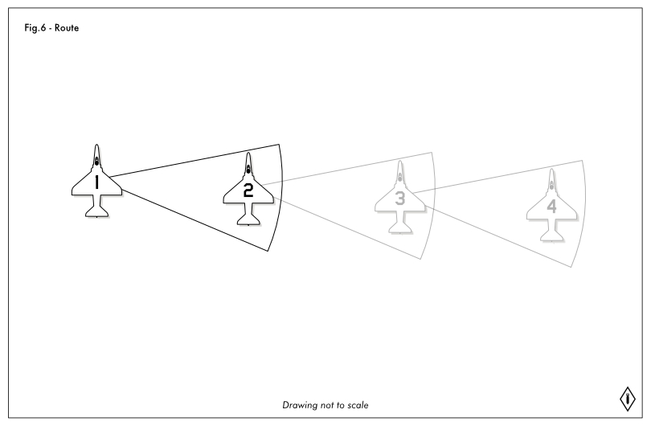
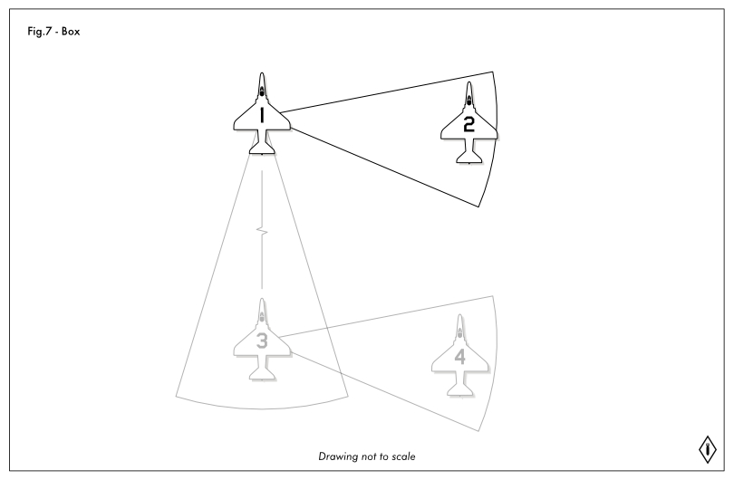

# Sortie 2 - Formations

## Overview
Here is a quick overview of each of the formations that we will be covering in this sortie. These formations are based on US Air Force terms and usage, the US Navy and other groups may have specific differences, but the foundations are the same.

## Contract Speed, Contract Turn
Flying in formation is about being a cohesive flight, to help maintain that cohesion we use contracts. Contracts are pre-defined flight parameters that are used.

One of those parameters is contract speed, which is the speed that will be used by the flight unless otherwise required. Contract speed can vary aircraft type, and can be briefed at other specific speeds for mission needs such as time on target.

Think of a contract speed as the speed limit sign for a flight. The default contract speed if none is known is 250 KIAS.

Once a flight is in a tight formation such as finger-four or echelon, wingmen do not have the ability to look at their speed, and will fly off the specific speed of their flight lead. However when re-joining a formation the contract speed plays a large part.

We will cover other forms of contract flight in other sections at greater detail. However the other major type of contract is for turns. A contract turn is a 3G turn at 30° of bank to the heading or heading offset as required.

## TACAN Yardstick
The TACAN Yardstick is a method of using air-to-air TACAN with another aircraft in your flight to measure distance. Smaller aircraft such as fighters do not have the equipment required to provide TACAN bearing information, so the bearing portion of your instruments will not be utilized.

**NOTE ON THE A4** The A-4-E third party mod for DCS, or any other third party non-official aircraft do not have access to the API for the TACAN, so they are unable to use the YARDSTICK functionality.

To set up TACAN as a yardstick is quite simple. Without getting too technical, each TACAN channel has a harmonic pair that syncs with it, these pairs are 63 channels apart on the same band. So 38Y and 101Y are a pair of channels. Flight lead will set their TACAN to A/A and T/R, the correct band, X or Y, and then to the briefed frequency. The wingman does the same, setting the correct band and mode, and to the paired frequency that matches that of the lead.

TACAN yardstick only works between two aircraft, so it may be required in flights of four aircraft to set yardstick between DASH-1 and DASH-2, and a separate yardstick between DASH-3 and DASH-4. It may also make more sense for DASH-1 and DASH-3 to have a yard stick, and DASH-2 and DASH-4 to simply fly a close visual formation.

## Finger-Four Formation
Finger-four, or "fingertip" formation is the foundational base formation for fighter aircraft. This formation is sometimes also referenced as a parade formation when flown in very tight spacing.

The visual queues and references for the positioning of this formation are specific to each airframe, but the positioning is the same. It is common for newer pilots to fly "sucked", which is too far back in the formation. This makes it impossible for the lead to easily see his wingmen. It may be easier to give yourself a bit more lateral spacing at first which makes speed changes more forgiving. As you become more comfortable you can then fly tighter in formation or as requested by flight lead.

The visual queues and references of this formation are the same for each aircraft no matter their position, making it a good formation for pilots to learn first.

The formation consists of two, two ship elements. DASH-1 generally in lead position, DASH-2 in formation with them on the outside of the formation. DASH-3 in formation with DASH-1 on the opposite side of DASH-2, and DASH-4 in formation with DASH-3. This makes it much easier for the flight elements to split off into their two ship formations when required.

Finger four formation is a very concentration intensive formation, and it is normal at first to find it difficult and tiring, but it does become easier with experience and practice.

## Echelon Formation
An Echelon formation is nearly identical to the Finger-four formation, with one exception. In the echelon formation all aircraft are off the same side of the flight lead. This means that DASH-3 is flying formation off of DASH-2.

This type of formation is often used in mass formations with multiple other flights flying in formation, or when flying formation with larger aircraft, such as the tanker.

### Formation with the Tanker
Flying formation with the tanker has only one minor difference from any other large aircraft. Often a tanker may be busy, and have multiple flights of aircraft waiting to tank. These flights will fly left-echelon formations that trail the group of aircraft ahead of them at 1 nautical mile increments. 

Once the group currently at the tanker is complete, then the next flight will accelerate forward and form in a left echelon with the tanker. Each aircraft will then transition to pre-contact one at a time, and when finished they will then form in a right echelon off of the tanker's right side to wait for the rest of the flight to finish aerial refueling. Once complete they will break away from the tanker safely and the next flight can advance up to the tanker.

## Wedge Formation
A wedge formation is not a commonly used formation, essentially the same as a echelon formation with aircraft sucked back further. This characteristic makes it non ideal. Despite the name wedge, a wedge formation is all aircraft off of one side of the flight lead, forming one side of the wedge.

## Trail Formation
As the name implies, a trail formation is where the wingman follows the lead aircraft. This type of formation is often used on attack runs, or for low level obstacle clearing.

It is critically important for the following aircraft to spot where the lead aircraft performs their turn, and to turn in the same spot, otherwise the following aircraft will be leading or lagging on turns and will need to adjust speed to compensate spacing.

Spacing on a trail formation can be as close as directly under the lead aircraft, to as much as 1 nautical mile. Care must also be taken in trail formations to clear the wake turbulence of the leading aircraft, typically by flying under the lead aircraft for better visibility, but will also require flying above the lead aircraft when at low altitudes.

## Route Formation
Route formation spreads the formation out to allow pilots to go heads down, but care must be taken not to have your head in the cockpit for any longer periods of time. TACAN yardstick is often used in this type of formation to improve situational awareness on the distance between lead and wingman.

A route formation would normally be used on a longer leg of a route, to allow for better visual look out, and to make it possible for pilots to adjust radios, navigate, or other in cockpit tasks.

Normally route formation is flown with a 500 foot distance, no further forward then a line drawn straight out from the lead aircraft at 90° to approximately 10° rearward of that line. You also have ± 2000 feet (1000 above, 1000 below) of elevation difference.

You may notice as you increase your lateral spacing from the flight lead that you have an easier time adjusting your speed to match.

## Combat/Defensive Spread
When flying in an air combat environment, or a hostile airspace, a Combat or Defensive spread allows the most maneuverability for a flight of aircraft. The increased distances make use of TACAN Yardstick to maintain cohesion.

The formation is formed identically to the route formation, with a greater lateral and vertical distances allowed between aircraft in the formation. In this formation it is important for all pilots to keep close track of their wingmen and flight lead to ensure they remain in formation with the correct aircraft, and that no unknown aircraft join the formation.

Wingmen position themselves approximately 90° off of the flight leads wing, at about 1 to 1.5 nautical miles distance and 4000± vertical separation (2000ft above, 2000ft below) to the flight leads altitude.

## Two and Four Ship Formations
A four-ship formation is made up of two two-ship elements who are flying in formation together. Similar to fire-teams in a squadron of infantry. DASH-1 and DASH-2 are the first flight, with DASH-3 leading the second element of DASH-4.

Typically you will transit to your mission area as a four ship and then break off into tactical elements (the 2 ship sub-formations). 

## Other Formations
There are many other variations and types of formations that can be utilized, most are simply variations of these key formations, such as abreast which is a tighter route formation, or a box which two formations of aircraft in line abreast following each other in a trail formation.

Formations can often be formed as a LEFT or RIGHT variant, this should be fairly obvious, as the formation should be formed to that side of the flight lead.
