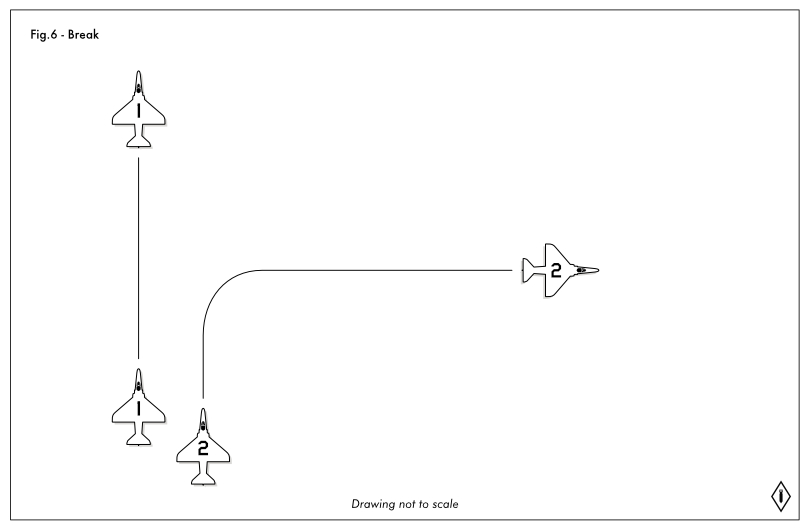

# Sortie 2 - Maneuvers

## Formation Maneuvering
Flying as a formation group is a demanding skill set that is difficult to learn. It takes coordination and planning for a flight to stay in formation as they maneuver. By using specific types of turns we can simplify this process through standardization.

There are differences between what is often called Navy style or USAF style formation flying, the differences are minimal, and all of the skills you learn here will apply to that style of flying as well. However as this course is primarily designed for a USAF and USAFE squadron environment we will focus on that style of flying.

This means when flying formation turns and maneuvers we place the aircraft ahead of us in formation (typically our flight lead) on the horizon when possible.

## Zip Lip
Zip lip formation flying is when a group flies without any radio transmissions, in real life usually used to avoid detection by an enemy. It is also considered to be very cool, so many groups aim for this. However real life zip lipped formation flying requires hand signals and subtle wing movements. DCS does not model this well at this time, so we do not recommend this sort of flying, and we will not be training in that environment.

## Contract Turn, Contract Speed
As mentioned in the section on [Formations](../formations/), a contract speed is a pre-defined speed that a formation will fly, to assist in rejoins and cohesion. Similarly a contract turn defines the rate of turn to keep cohesion of the formation when they make maneuvers.

A contract turn is either 30° of bank and keep the horizon level in your turn at mil power, or a knife edge 3g pull holding the horizon level. The 3g pull is usually considered the high performance turn.

## Check Turn
A check turn is a standard gentle turn as a formation. Flight lead will call out a direction and final heading, and then give a "go" word, often "check" or "mark" as the signal to begin the turn. These turns are usually at no more then a 30° bank horizon level contract turns.

As the signal is given, begin your turn by pulling the correct amount of roll, and gently but quickly pulling the required amount of G-loading, simultaneously increase power to the required amount/Them maintain the G-loading until you begin rolling out into the new final heading. A Flight lead may make a correction callout to a new heading during the turn, this heading may require ending the turn earlier, or extending it longer.

On final heading roll out back to level flight, unload G-load on the aircraft smoothly and quickly to maintain level flight, and reduce power back to the same setting that was required to maintain positioning in the formation previously. When completed correctly your spacing in the formation should be the same as it was coming into it.

## Delayed Turn
A delayed turn is much like a check turn, with a delay. The result of a delayed turn is that it causes the aircraft to change sides.

When flying a delayed turn, flight lead with give the same information, but with the added keyword of delayed. Then the outside pilot will begin their turn at the go command, calling out when their nose crosses the other aircraft with "crossing" as a command, the delayed aircraft then begins their turn. A Delayed turn is usually a high performance knife edge contract turn.

*NOTE:* In the real world the actual queue to begin your turn is being able to see down the intakes of the aircraft on the inside, however this can be difficult in DCS until a group is very comfortable with each other. So we opt to use a crossing callout instead.

An example of the call-outs for this type of turn, TALON-2 is the outside aircraft, so making TALON-1 the delayed aircraft:
> TALON 1: TALON FLIGHT, DELAYED RIGHT, TWO SEVEN ZERO, MARK.
> TALON 2: CROSSING

## In-Place
An in-place turn is used when transitioning the formation from an echelon, route, or spread formation into a trailing formation, or from a trailing formation into an echelon, route or spread formation.

With an in-place formation turn, all aircraft start their turn at the same time, which results in the inside aircraft ending up ahead of the aircraft on the outside of the turn. Generally an in place turn is no more then 90°. An in place turn is usually a high performance contract turn.

When performing an in-place turn the flight lead will call out the direction, final heading and the keyword "In-Place" to signify an in-place turn.

## Hook
A Hook turn changes both side of the formation, and the direction you are flying.They can be used to switch the direction of flight, they typically result in a final heading 180° off of the current heading, but there is the ability to adjust the exact final heading. 

When the flight lead calls a hook turn it is normally only direction and the keyword hook. In this situation it is important to quickly take note of your current heading and the reciprocal heading so that you know when to pull out of your turn. A flight lead may give an exact heading for the desired turn out.

## Shackle
A shackle is the preferred way to switch sides in a formation. The reason is that by having both aircraft moving to the other side you minimize the amount of time required.

A shackle is performed by both aircraft turning towards the other at 45°. Take time to count how long you take until you cross the lead, and then count the same amount of time once you pass the lead. Make a callout when you reach that distance and pull back into formation heading. 

## Break
A break or breakaway is an expedited way to leave formation.  A break allows you to quickly create that separation in leaving the formation, or change direction.

Breaks are used both for tactical reasons such as defensive maneuvers, and for formation maneuvering reasons such as landing as a group..

A brake is a max performance turn away from the formation at MIL power, anywhere from 45° to a full 180°.

## Bracket
A bracket maneuver is much like a break and a shackle, both aircraft simultaneously turn approximately 45° away from course to position themselves on both sides of a target or objective.

This maneuver is called with Bracket and the target or objective you are bracketing.

